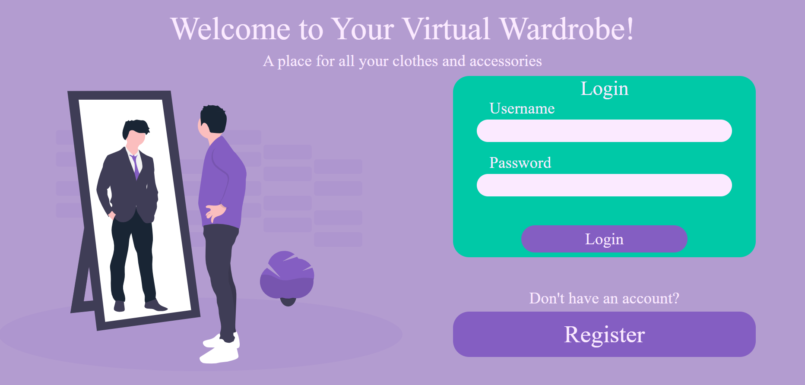
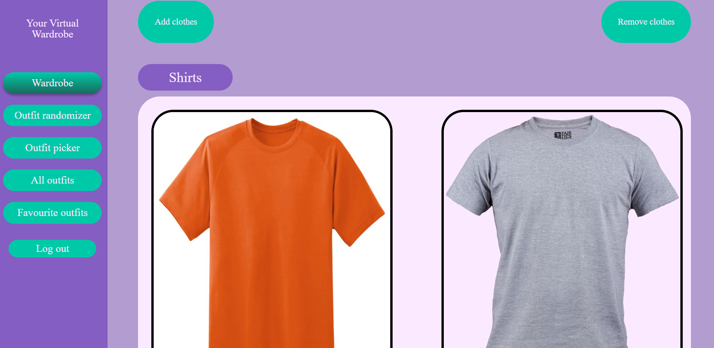

# WDPAI - Your Virtual Wardrobe
> Transfer your wardrobe to a virtual world!

## Table of contents
* [General info](#general-info)
* [Technologies](#technologies)
* [Screenshots](#screenshots)
* [Usage](#general-info)

## General info
- Take photos of your clothes and upload them
- Add and remove pieces of clothing
- Compose outfits
- View your pieces of clothing and outfits

## Technologies 
- HTML5
- CSS3
- PHP 7.4
- DOCKER
- POSTGRES 

## Screenshots




## Usage
- Enter your IPv4 address in the config.php file
- Create the container with ```docker compose up```
- Access the app at ```http://localhost:8080/index```